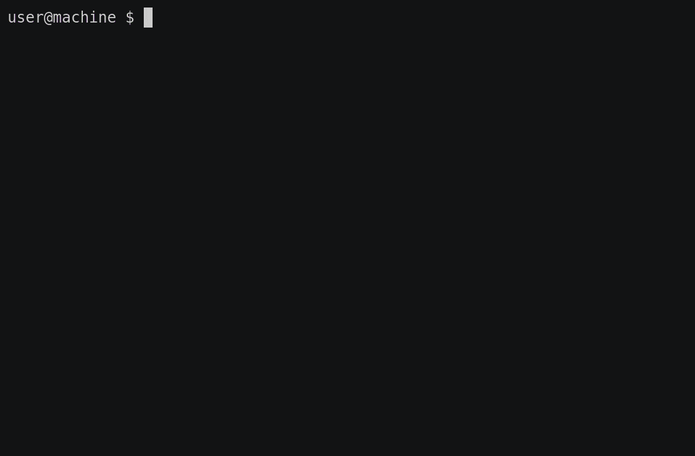

# rmatrix
Generates a 'Matrix'-like screen of falling characters in your terminal

The original [`cmatrix`](https://github.com/abishekvashok/cmatrix) was written in C, and crashes when you wildly resize the window.
The rust version is memory-safe, and doesn't crash so easily. Both versions have comparable performance, due to the underlying use of `ncurses`.

## Controls

qwerty keyboards:  
`q` red, `w` green, `e` yellow, `r` blue, `t` pink, `y` white, `u` cyan, `i` rainbow

azerty keyboards:  
`a` red, `z` green, `e` yellow, `r` blue, `t` pink, `y` white, `u` cyan, `i` rainbow

`j` - Jap characters  
`c` - Classic characters

`0-9` speed of rain

### Build
`cargo build --release` or `cargo install rmatrix`
