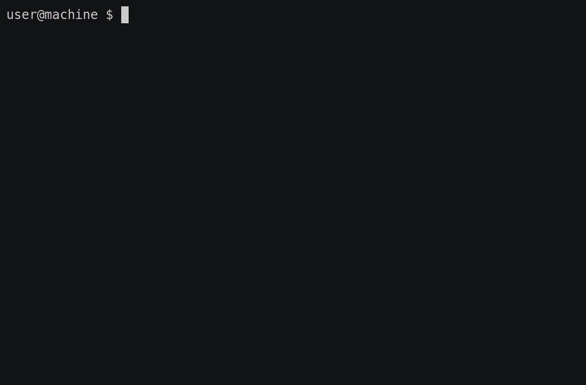

# rmatrix

Generates a 'Matrix'-like screen of falling characters in your terminal

The original [`cmatrix`](https://github.com/abishekvashok/cmatrix) was written in C, and crashes when you wildly resize the window.
The rust version is memory-safe, and doesn't crash so easily.
This version uses `crossterm` for cross-platform terminal support without needing `ncurses` installed.

## Controls
| Key | Control |
| -- | -- |
| 1-9 | Speed the letters fall (1 is fastest, 9 is slowest) |
| Shift + 1-9 | Colour of the characters |
| r | Rainbow mode |

